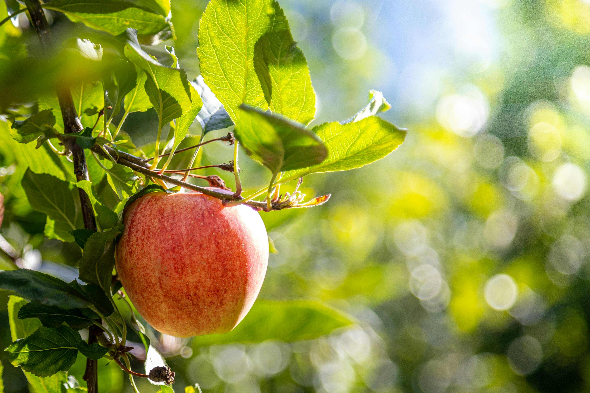
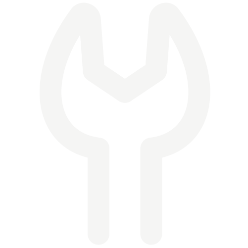
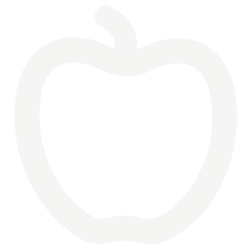
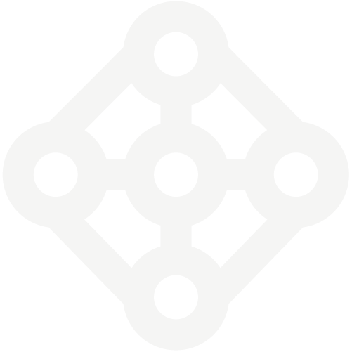
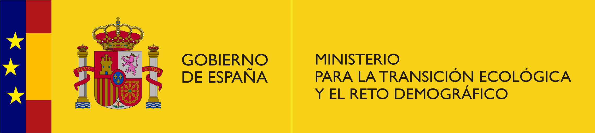
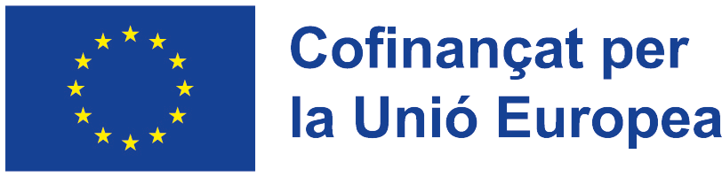

::: {.page-title-band}
# Sobre nosaltres
:::

```{=html}
<div class="about-hero">
  <div class="about-hero-image">
    
  </div>
  <div class="about-hero-text">
    <p>FruitMeasureApp és una aplicació mòbil basada en intel·ligència artificial dissenyada per estimar la mida de la fruita directament a partir d'imatges preses amb smartphones, donant suport a la presa de decisions en l'agricultura de precisió.</p>
    <p>Aquest projecte forma part d'un projecte de recerca i demostració centrat en la validació i la transferència d'eines basades en IA al sector fructícola.</p>
  </div>
</div>
```

::: {.section-dark}
::: {.section-inner--wide}

## Objectius principals

```{=html}
<div class="icon-grid">
  <div class="icon-grid-item">
    
    <p>Prototipatge i millora de l'aplicació mòbil</p>
  </div>
  <div class="icon-grid-item">
    
    <p>Validació i avaluació de la tecnologia</p>
  </div>
  <div class="icon-grid-item">
    
    <p>Demostració de casos d'ús reals en fructicultura</p>
  </div>
  <div class="icon-grid-item">
    
    <p>Suport a la transferència tecnològica i la divulgació</p>
  </div>
</div>
```

:::
:::

::: {.section-light}
::: {.section-inner--wide}

## Impacte

```{=html}
<div class="icon-grid">
  <div class="icon-grid-item">
    
    <p>Reduir el temps i la mà d'obra necessaris per a la mesura de fruita</p>
  </div>
  <div class="icon-grid-item">
    
    <p>Millorar la consistència i reduir l'error humà</p>
  </div>
  <div class="icon-grid-item">
    
    <p>Donar suport a la presa de decisions basada en dades als camps</p>
  </div>
  <div class="icon-grid-item">
    
    <p>Facilitar la transició cap a l'agricultura digital</p>
  </div>
</div>
```

:::
:::

::: {.section-light style="padding-top: 2rem;"}
::: {.section-inner}

## Estat del projecte

- Projecte actiu de recerca i desenvolupament (2024–2026).
- Aplicació mòbil publicada per a ús públic.
- Inclou pipelines d'inferència i entrenament del model.

:::
:::

::: {.section-light style="padding-top: 2rem;"}

## Institucions i col·laboració

<p>Aquest projecte és una col·laboració entre:</p>

```{=html}
<div class="credits-logos" style="padding-bottom: 3rem;">
  <div class="credits-logos-row">
    
    
  </div>
</div>
<div style="max-width: var(--fm-inner-max); margin: 0 auto; padding: 0 2rem 1rem; font-size: clamp(1rem, 1.4vw, 1.1rem); color: var(--fm-text);">
<p>Activitat cofinançada per la UE a través de la intervenció 7201 del Pla Estratègic de la PAC 2023-2027.</p>
</div>
<div class="credits-logos" style="padding-bottom: 5rem;">
  <div class="credits-logos-row">
    
    
    
  </div>
</div>
```

:::