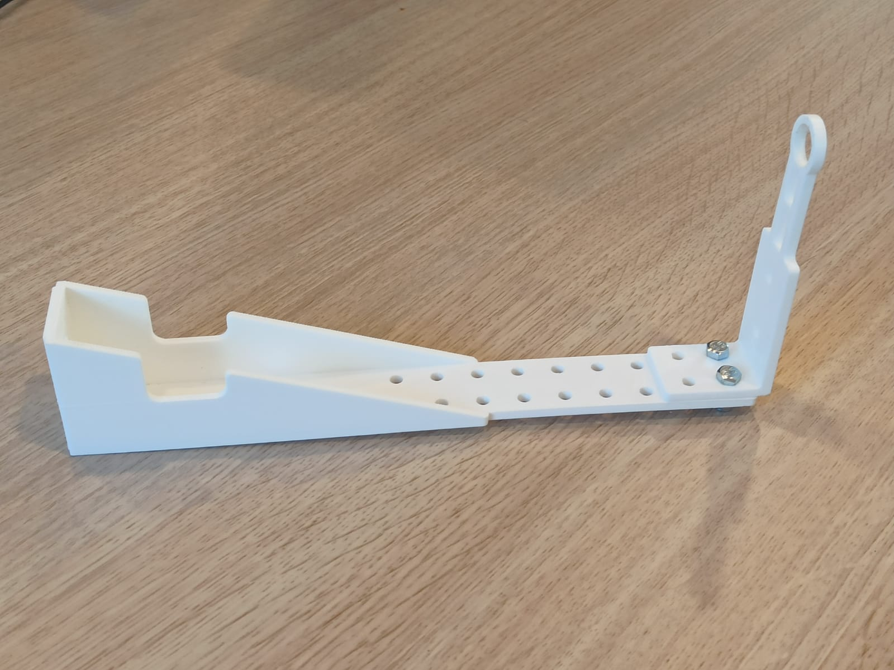

::: {.page-title-band}
# Recursos
:::

::: {.section-dark}
::: {.section-inner--wide}
::: {.resource-stick}

::: {.resource-stick-text}

## FruitMeasure Stick

El FruitMeasure Stick és necessari per capturar totes les fotos per a FruitMeasureApp.

::: {.resource-stick-buttons}
[Obtenir el fitxer 3D](../../assets/suport3D/FruitMeasureStick_3D_stl.zip){.btn-store .btn-store--outline}
[Com muntar-lo](#){.btn-store .btn-store--outline}
[On imprimir-lo](#){.btn-store .btn-store--outline}
:::

:::

::: {.resource-stick-image}

:::

:::
:::
:::


::: {.section-light}
::: {.section-inner}
::: {.resource-block}

## Obtén la guia d'usuari

Descarrega la guia completa de l'usuari per resoldre qualsevol dubte i entendre més en profunditat com funciona FruitMeasureApp.

[Descarrega la guia de FruitMeasureApp →](../../assets/pdfs/Manual_usuari_CAT.pdf){.resource-link}

:::
:::
:::

<hr class="section-divider"/>

::: {.section-light style="padding-top: 3rem; padding-bottom: 3rem;"}
::: {.section-inner}
::: {.resource-block}

## Prova FruitMeasureApp

[Obtenir imatges →](#){.resource-link}

:::
:::
:::

<hr class="section-divider"/>

::: {.section-light .section-model-top}
::: {.section-inner--wide}

## Explora el model d'IA {style="text-align:center;"}

::: {.model-intro}
L'aplicació utilitza una xarxa neuronal convolucional (CNN) per a la detecció i segmentació de fruites, combinada amb calibratge geomètric mitjançant un marcador de referència.
:::

::: {.model-columns}

::: {}
**Pipeline:** Calibrar → Capturar → Detectar → Mesurar

## Executar mode inferència Fruit

```bash
python main.py --mode Fruit --image example_images/IMG_20240828_122454.jpg
```

## Executar mode inferència Cluster

```bash
python main.py --mode Cluster --image example_images/IMG_20240828_122454.jpg
```
:::

::: {}

## Arguments opcionals

::: {.code-tag}
--dist_fruit2cam
:::

Distància (mm) de la fruita a la càmera (per defecte: 250 mm)

## Sortida

::: {.output-row}
[*_results.csv]{.code-tag} → El diàmetre més la confiança
:::
::: {.output-row}
[*_mask_dets.jpg]{.code-tag} → Segmentació
:::
::: {.output-row}
[*_bb_dets.jpg]{.code-tag} → Crear els bounding boxes
:::

:::

:::
:::
:::

```{=html}
<div class="section-gallery">
  <div class="resource-gallery">
    
    
    
  </div>
</div>
```
