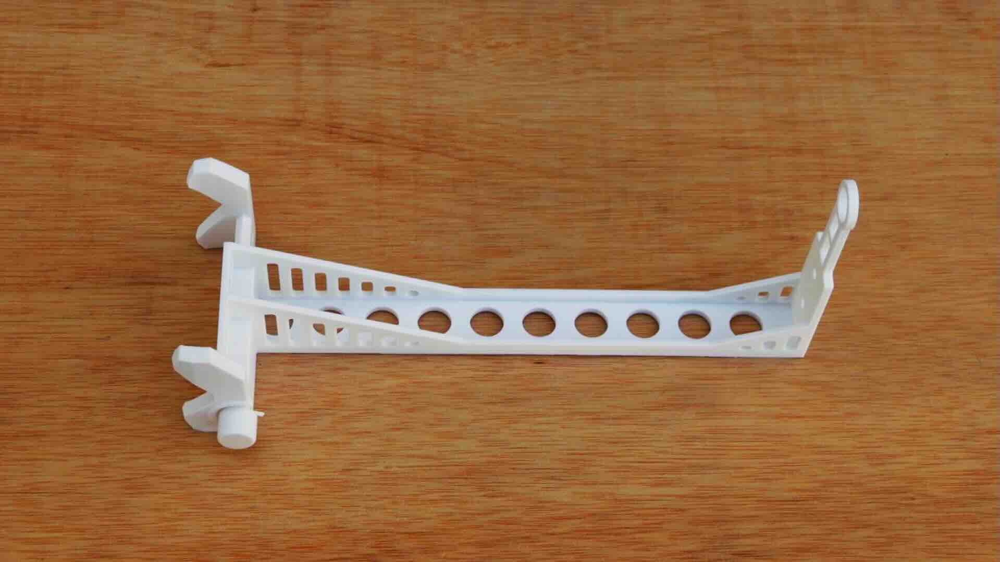
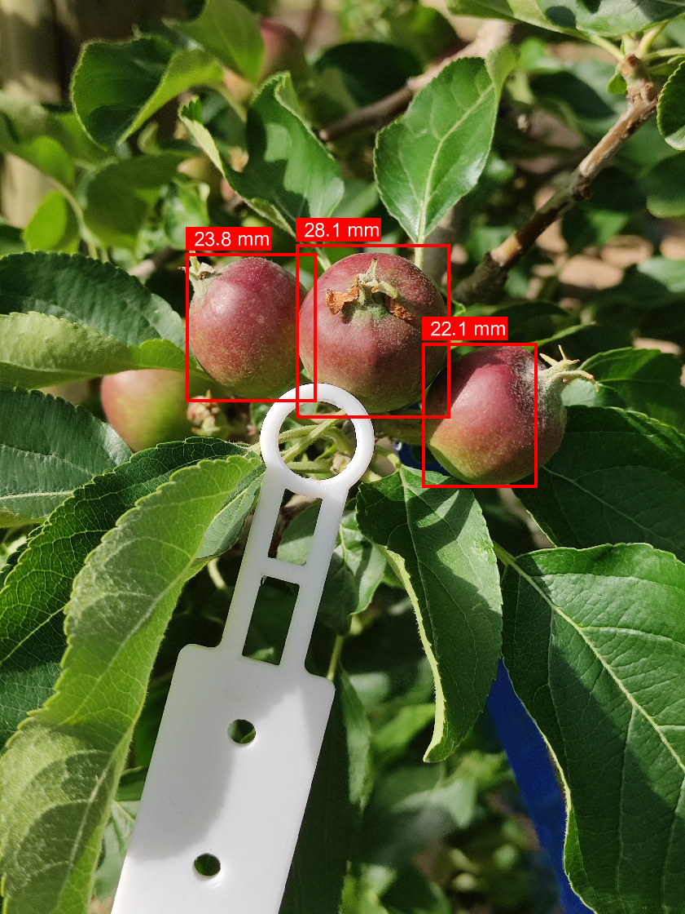
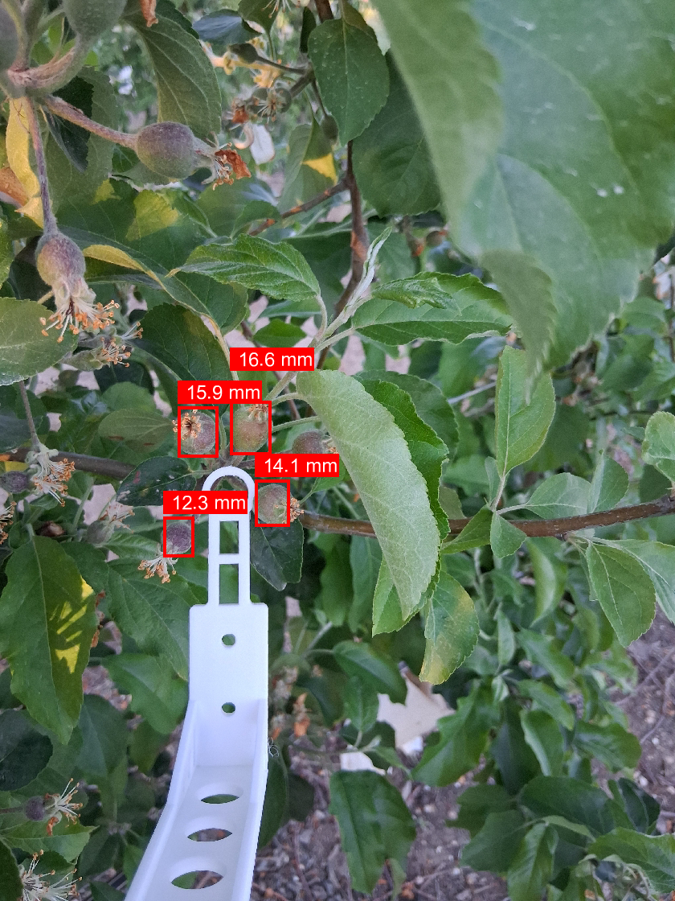
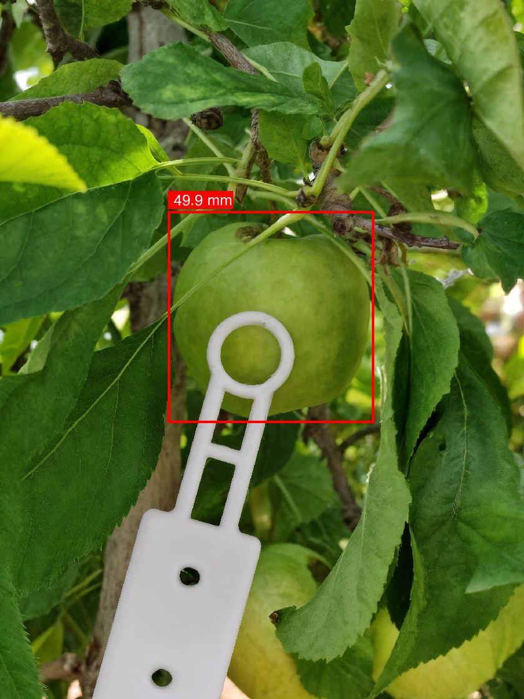

::: {.page-title-band}
# Recursos
:::


::: {.section-dark}
::: {.section-inner}

## Obtén la guía de usuario

Descarga la guía completa del usuario para resolver cualquier duda y entender más en profundidad cómo funciona FruitMeasureApp.

::: {.resource-cta-group}
[Descargar la guía →](../assets/pdfs/Manual_usuari_EN.pdf){.btn-store .btn-store--outline}
[Ver el videotutorial →](../assets/videos/FruitMeasureApp.mp4){.btn-store .btn-store--outline}
:::

:::
:::


<!-- 2. FRUITMEASURE STICK -->

::: {.section-light}

```{=html}
<div class="about-hero">
  <div class="about-hero-image">
    
  </div>
  <div class="about-hero-text">
    <h2>FruitMeasure Stick</h2>
    <p>El FruitMeasure Stick es necesario para capturar todas las fotos para FruitMeasureApp. Imprímelo con una impresora 3D y móntalolo siguiendo la guía.</p>
    <div class="resource-stick-buttons">
      <a href="../assets/suport3D/FruitMeasureStick_3D_stl.zip" class="btn-store btn-store--filled">Obtener el archivo 3D</a>
      <a href="#" class="btn-store btn-store--filled">Cómo ensamblarlo</a>
      <a href="#" class="btn-store btn-store--filled">Dónde imprimirlo</a>
    </div>
  </div>
</div>
```

:::


<!-- 3. PRUEBA FRUITMEASUREAPP -->

::: {.section-dark}
::: {.section-inner}

## Prueba FruitMeasureApp

- Descarga la app y empieza a medir el tamaño de los frutos directamente desde tu smartphone.
- Puedes probar la aplicación con imágenes de prueba, sin necesidad de imprimir el soporte ni capturar imágenes en campo. Descárgalas en el siguiente enlace:

::: {.resource-cta-group}
[Play Store](https://play.google.com/store/apps/details?id=com.anphis.es.fruit_measure_app){.btn-store .btn-store--outline}
[Apple Store](https://apps.apple.com/es/app/fruitmeasureapp/id6758163918){.btn-store .btn-store--outline}
[Descargar imágenes de prueba →](../assets/app/imatges_test_app.zip){.btn-store .btn-store--outline}
:::

:::
:::


<!-- 4. EXPLORA EL MODELO DE IA -->

::: {.section-light .section-model-top}
::: {.section-inner--wide}

## Explora el modelo de IA {style="text-align:center;"}

::: {.model-intro}
La aplicación utiliza una red neuronal convolucional (CNN) para la detección y segmentación de frutas, combinada con calibración geométrica mediante un marcador de referencia.
:::

::: {.model-columns}

::: {}
**Pipeline:** Calibrar → Capturar → Detectar → Medir

## Ejecutar modo inferencia Fruit

```bash
python main.py --mode Fruit --image example_images/IMG_20240828_122454.jpg
```

## Ejecutar modo inferencia Cluster

```bash
python main.py --mode Cluster --image example_images/IMG_20240828_122454.jpg
```
:::

::: {}

## Argumentos opcionales

::: {.code-tag}
--dist_fruit2cam
:::

Distancia (mm) desde la fruta a la cámara (por defecto: 250 mm)

## Salida

::: {.output-row}
[*_results.csv]{.code-tag} → El diámetro más la confianza
:::
::: {.output-row}
[*_mask_dets.jpg]{.code-tag} → Segmentación
:::
::: {.output-row}
[*_bb_dets.jpg]{.code-tag} → Crear los bounding boxes
:::

:::

:::
:::
:::

```{=html}
<div class="section-gallery">
  <div class="resource-gallery">
    
    
    
  </div>
</div>
```

::: {.section-light style="padding: 1rem 2rem 3rem; text-align:center;"}
[Repositorio oficial →](https://github.com/GRAP-UdL-AT/FruitMeasureApp){.resource-link}
:::
