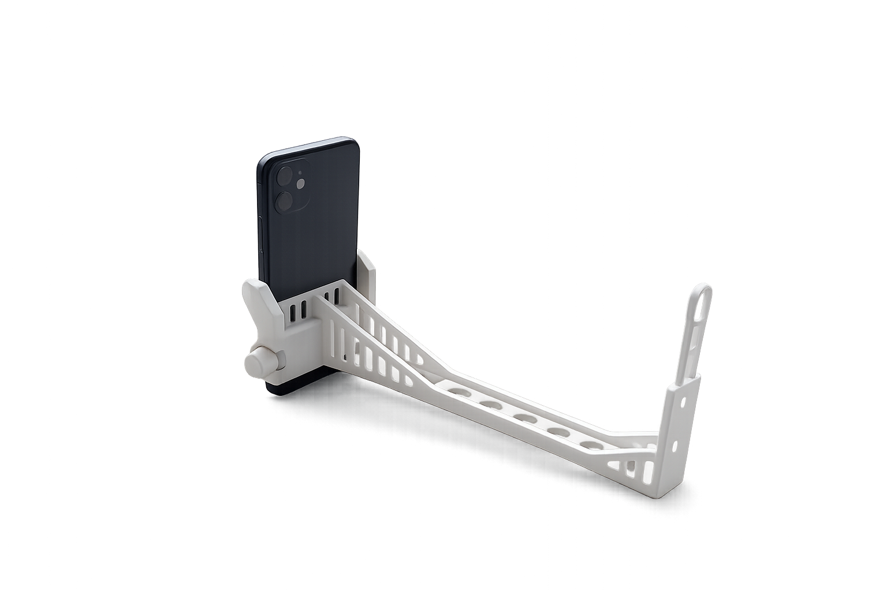

::: {.page-title-band}
# Recursos
:::


::: {.section-dark}
::: {.section-inner}

## Obté la guia d'usuari

Descarrega la guia completa de l'usuari per resoldre qualsevol dubte i entendre més en profunditat com funciona FruitMeasureApp.

::: {.resource-cta-group}

[Descarrega la guia →](https://github.com/dcg-udl-cat/fruitmeasureapp.udl.cat/releases/download/1.0/Manual_usuari_CAT.pdf){.btn-store .btn-store--outline}
[Visualitza el videotutorial →](https://github.com/dcg-udl-cat/fruitmeasureapp.udl.cat/releases/download/1.0/FruitMeasureStick_CAT.mp4){.btn-store .btn-store--outline}
:::

:::
:::

::: {.section-light}

```{=html}
<div class="about-hero">
  <div class="about-hero-image">
    
  </div>
  <div class="about-hero-text">
    <h2>FruitMeasureStick</h2>
    <p>Per utilitzar FruitMeasureApp es necessita el FruitMesaureStick. Aquest accessori s’acobla al telèfon mòbil i serveix com a referència per estimar la mida de les pomes. Imprimiu-lo amb una impressora 3D i munteu-lo seguint la guia.</p>
    <div class="resource-stick-buttons">
      <a href="https://github.com/dcg-udl-cat/fruitmeasureapp.udl.cat/releases/download/1.0/FruitMeasureStick_3D_files.zip" class="btn-store btn-store--filled">Obtenir el fitxer 3D</a>
      <a href="https://github.com/dcg-udl-cat/fruitmeasureapp.udl.cat/releases/download/1.0/VideoTutorial_CAT.mp4" class="btn-store btn-store--filled">Com muntar-lo</a>
    </div>
  </div>
</div>
```

:::

::: {.section-dark}
::: {.section-inner}

## Prova FruitMeasureApp

- Descarrega l'aplicació i comença a mesurar el calibre dels fruits directament des del teu telèfon mòbil.
- Podeu provar l'aplicació amb imatges de prova, sense necessitat d'imprimir el suport ni capturar imatges a camp. Descarregueu-les al següent enllaç:

::: {.resource-cta-group}
[Play Store](https://play.google.com/store/apps/details?id=com.anphis.es.fruit_measure_app){.btn-store .btn-store--outline}
[Apple Store](https://apps.apple.com/es/app/fruitmeasureapp/id6758163918){.btn-store .btn-store--outline}
[Descarrega les imatges de prova →](https://github.com/dcg-udl-cat/fruitmeasureapp.udl.cat/releases/download/1.0/imatges_test_app.zip){.btn-store .btn-store--outline}
:::

:::
:::

::: {.section-light .section-model-top}
::: {.section-inner--wide}

## Explora el model d'IA {style="text-align:center;"}


- L’aplicació integra una xarxa neuronal convolucional (CNN) per a la detecció de fruits.
- Un calibratge geomètric mitjançant el marcador de referència situat a l’extrem del FruitMeasureStick permet mesurar els fruits de forma precisa.
- La CNN s’ha entrenat amb imatges de 4500 fruits en quatre campanyes (2023-2026). 
- Permet seleccionar dos models d’estimació: Corimbe (fruits petits agrupats) i Fruit (per pomes individuals).


```{=html}
<div class="section-gallery">
  <div class="resource-gallery">
    
    
    
  </div>
</div>
```

::: {.section-light style="padding: 1rem 2rem 3rem; text-align:center;"}
El codi font s’ha publicat en obert al  [Repositori oficial →](https://github.com/GRAP-UdL-AT/FruitMeasureApp){.resource-link}
:::

:::
:::
