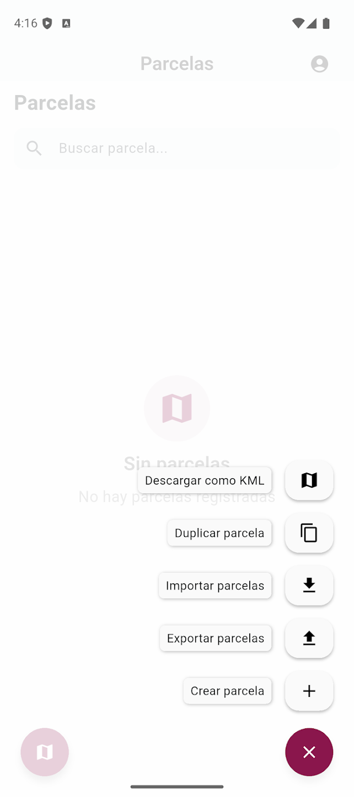
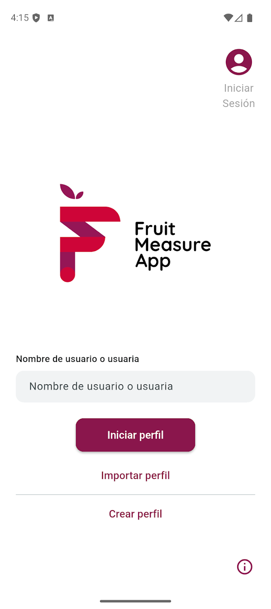
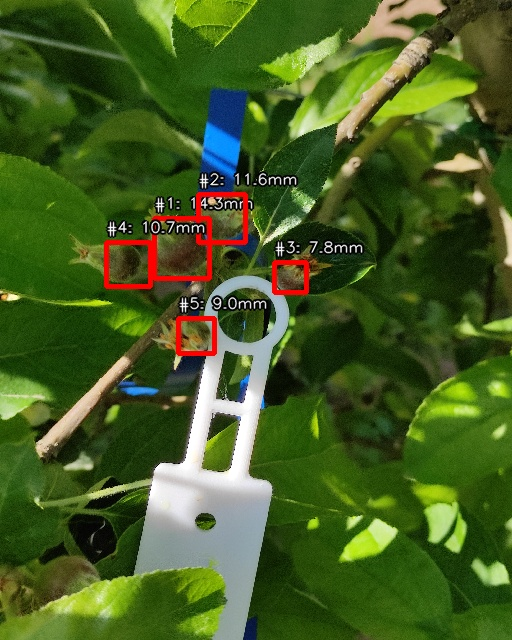
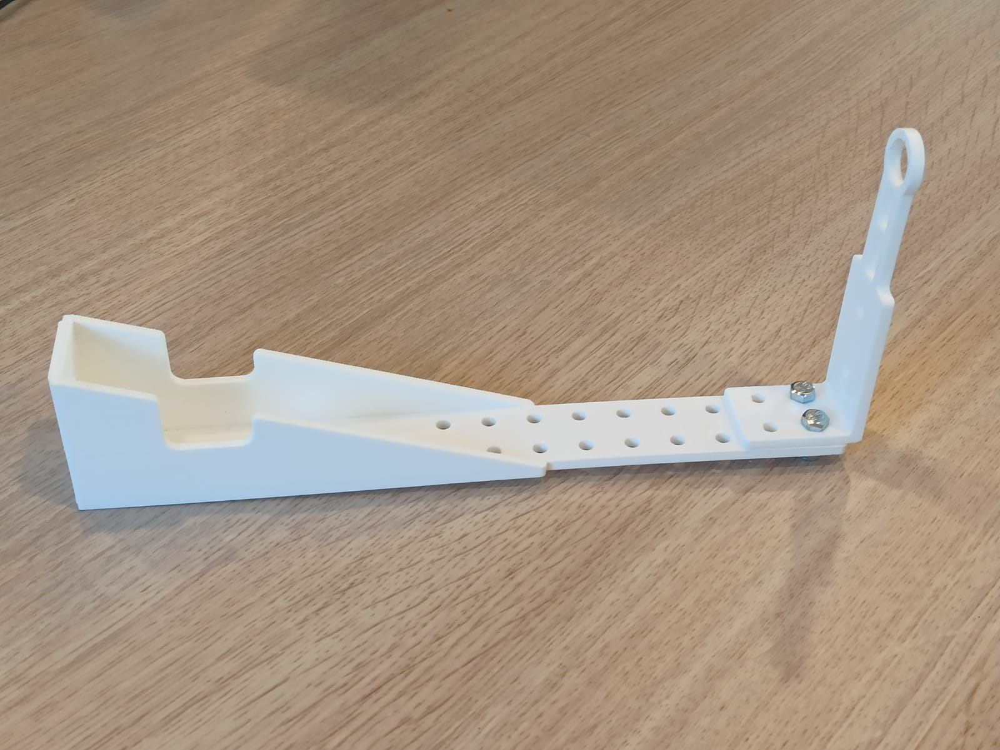

<!-- TODO: This is a proposed design for the homepage of the FruitMeasureApp project. It includes a hero section with an app demo video, a tabbed interface to explore the Android and iOS versions of the app and the underlying AI model, and sections highlighting the features and importance of the app. It can be redesigned and adjusted based on needs and feedback. -->

::: {.hero-banner}

::: {.content-block}

::: {.hero-text}

# Welcome to FruitMeasureApp {.mt-1}

### AI-powered fruit size measurement for precision agriculture

- Measure fruit diameter directly from your smartphone using images.
- Analyze single or multiple fruits in the same image.
- Replace manual measurements with an automated, AI-based approach.
- Get instant results to support fruit thinning decisions (Greene method).
- Use a simple and fast tool designed for real field conditions.

### Measure. Decide. Optimize.

::: {.availability}
Available on Android and iOS
:::

::: {.grid .gap-3 .pt-4}

::: {.g-col-12 .g-col-md-4}
[Get Started](documentation/getting-started.qmd){.btn-action .btn-action-primary .btn .btn-lg .w-100}
:::

::: {.g-col-6 .g-col-md-4}
[Google Play](#){.btn-action .btn-action-secondary .btn .btn-lg .w-100}
:::

::: {.g-col-6 .g-col-md-4}
[App Store](#){.btn-action .btn-action-secondary .btn .btn-lg .w-100}
:::

:::

:::


::: {.hero-media}

<!-- TODO: Prepare a short video using the app, showing the main features and workflow. This video can be used in the hero section to give visitors a quick overview of how the app works and its benefits. -->

::: light-content
```{=html}
<video autoplay muted playsinline loop>
  <source src="assets/videos/app_demo.mp4" type="video/mp4"/>
</video>
```
:::

::: dark-content
```{=html}
<video autoplay muted playsinline loop>
  <source src="assets/videos/app_demo_dark.mp4" type="video/mp4"/>
</video>
```
:::

:::

:::

:::

::: {.content-block}


::: {.grid .align-items-center}

::: {.g-col-lg-4 .g-col-12}
### FruitMeasureApp
Explore the mobile app and the AI model behind it.
:::

::: {.g-col-lg-8 .g-col-12}

<!-- TODO: Add proper screenshots of the app (android and iOS) also check the model and see if it enough or we can split it into different models (single,corimbe,...). -->

<ul class="nav nav-pills" id="app-tab" role="tablist">

  <li class="nav-item">
    <button class="nav-link active" data-bs-toggle="tab" data-bs-target="#android">
      Android
    </button>
  </li>

  <li class="nav-item">
    <button class="nav-link" data-bs-toggle="tab" data-bs-target="#ios">
      iOS
    </button>
  </li>

  <li class="nav-item">
    <button class="nav-link" data-bs-toggle="tab" data-bs-target="#model">
      Model
    </button>
  </li>

  <li class="nav-item">
    <button class="nav-link" data-bs-toggle="tab" data-bs-target="#support">
      Support
    </button>
  </li>

</ul>

:::
:::

---

<div class="tab-content mt-4">

<!-- ANDROID -->
<div class="tab-pane fade show active" id="android">

::: {.grid .gap-3}

::: {.g-col-md-4 .g-col-12}

:::

::: {.g-col-md-4 .g-col-12}

:::

::: {.g-col-md-4 .g-col-12}

:::

:::

</div>

<!-- IOS -->
<div class="tab-pane fade" id="ios">

::: {.grid .gap-3}

::: {.g-col-md-4 .g-col-12}

:::

::: {.g-col-md-4 .g-col-12}

:::

::: {.g-col-md-4 .g-col-12}

:::

:::

</div>

<!-- MODEL -->
<div class="tab-pane fade" id="model">

::: {.grid .gap-4}

::: {.g-col-lg-6 .g-col-12}

The app uses a convolutional neural network (CNN) for fruit detection and segmentation, combined with geometric calibration using a reference marker.

**Pipeline:**  
Calibrate → Capture → Detect → Measure

---

### Run inference (fruit)

```bash
python main.py --mode Fruit --image example_images/IMG_20240828_122454.jpg
```

### Run inference (corimbe)

```bash
python main.py --mode Corimbe --image example_images/IMG_20240426_100424.jpg
```

---

### Optional arguments

- `--dist_fruit2cam`  
  Distance (mm) from fruit to camera *(default: 250 mm)*

:::

::: {.g-col-lg-6 .g-col-12}

### Output

- `*_results.csv` → diameter + confidence  
- `*_mask_dets.jpg` → segmentation  
- `*_bb_dets.jpg` → bounding boxes  



:::

:::

</div>

<!-- Support -->
<!-- SUPPORT -->
<div class="tab-pane fade" id="support">

::: {.support-card}

::: {.grid .gap-4 .align-items-center}

::: {.g-col-lg-6 .g-col-12}

### 3D Printed Support

FruitMeasureApp uses a custom 3D-printed attachment to ensure consistent image capture and accurate calibration using a reference marker.

Designed for stable positioning and reliable measurements in real field conditions.

---

### Downloads

::: {.download-group}

[Download STL (base)](#){.btn-action .btn-action-primary .btn}

[Download STL (extrem)](#){.btn-action .btn-action-secondary .btn}

:::

:::

::: {.g-col-lg-6 .g-col-12 .text-center}

{.support-image}

:::

:::

:::

</div>


::: {.content-block}

## What you can do {.section-title}

::: {.features}

::: {.feature}
### Measure accurately  
Estimate fruit diameter directly from images with high precision.
:::

::: {.feature}
### Work faster  
Process multiple fruits in seconds with minimal manual effort.
:::

::: {.feature}
### Use in the field  
Designed for real agricultural conditions using a mobile device.
:::

::: {.feature}
### Support decisions  
Guide fruit thinning and crop management.
:::

::: {.feature}
### Reduce errors  
Replace manual tools with consistent AI-based measurements.
:::

::: {.feature}
### Simple workflow  
Capture, analyze, and obtain results in seconds.
:::

:::

:::

::: {.content-block}

## Why it matters {.section-title}

- Reduce manual measurement errors and variability  
- Save time and labor in field workflows  
- Enable data-driven fruit thinning decisions  
- Accelerate adoption of precision agriculture tools  

:::

::: {.text-center .alt-background}

#### Supported by {.section-title}

{width="55%"}

<!-- TODO: Improve the logo with better resolution, and with no background (transparent PNG) for better integration in the page. Also, consider creating a light and dark version of the logo to adapt both themes. -->

:::
