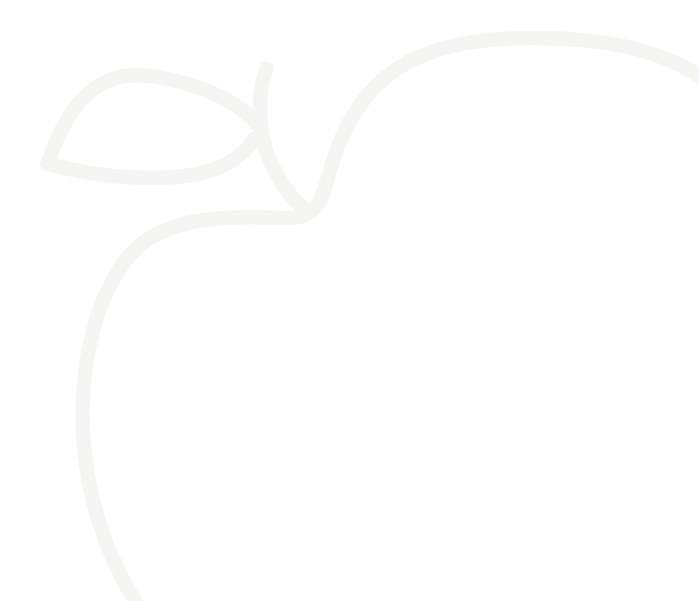

::: {.hero-banner}
::: {.content-block}
::: {.hero-text}

# Welcome to FruitMeasureApp

::: {.hero-subtitle}
AI-powered fruit size measurement for precision agriculture
:::

::: {.hero-store-buttons}
[Play Store](https://play.google.com/store/apps/details?id=com.anphis.es.fruit_measure_app){.btn-store .btn-store--outline}
[Apple Store](https://apps.apple.com/es/app/fruitmeasureapp/id6758163918){.btn-store .btn-store--outline}
:::

:::
::: {.hero-media}

:::
:::
:::

::: {.section-light}
::: {.section-inner}

## Measure. Decide. Optimize.

- Measure fruit diameter directly with your smartphone using images.
- Analyze single or multiple fruits in the same image.
- Replace manual measurements with an automated, AI-based approach.
- Get instant results to support fruit thinning decisions (Greene method).
- Use a simple and fast tool designed for real-field conditions.

:::
:::

::: {.section-dark}
::: {.section-inner--wide}

## How does it work?

::: {.video-wrapper}
```{=html}
<video autoplay muted playsinline loop>
  <source src="../assets/videos/FruitMeasureApp.mp4" type="video/mp4"/>
</video>
```
:::

[For more information download the FruitMeasureApp guide →](../assets/pdfs/Manual_usuari_EN.pdf){.guide-link}

:::
:::

::: {.section-light}
::: {.section-inner}

## Why it matters?

- Reduce manual measurement errors and variability.
- Save time and labour in field workflows.
- Enable data-driven fruit thinning decisions.
- Accelerate the adoption of precision agriculture tools.

:::
:::
