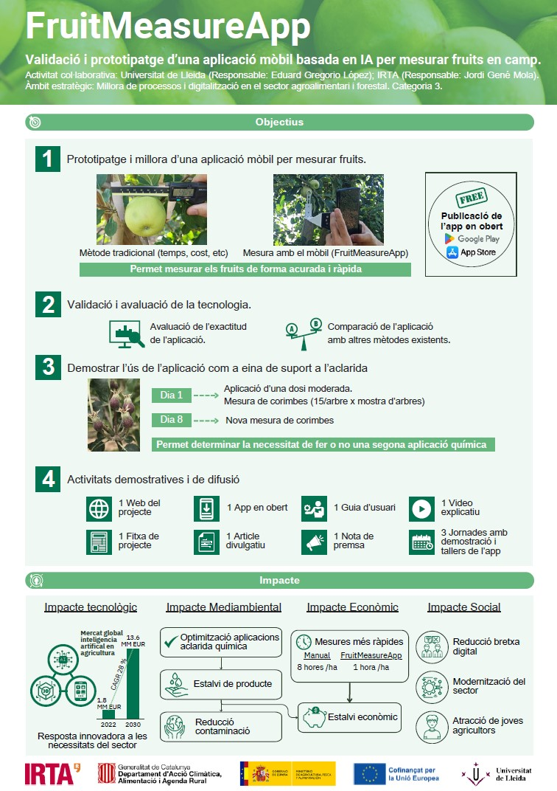

# About

FruitMeasureApp is a mobile application based on artificial intelligence designed to estimate fruit size directly from smartphone images, supporting decision-making in precision agriculture.

{.img-fluid .my-4}

The project focuses on providing a simple, fast, and reliable tool for measuring fruit diameter in real field conditions.

> TODO: Add information supporting the infographic, motivation, and impact of the project. This can include specific examples of how the app can be used in practice, as well as any preliminary results or case studies demonstrating its effectiveness.

## Project context

FruitMeasureApp is part of a research and demonstration project focused on validating and transferring AI-based tools to the fruit sector.

The main objectives include:

- Prototyping and improving the mobile application  
- Validating and evaluating the technology  
- Demonstrating real use cases in fruit growing  
- Supporting technology transfer and dissemination  

## Institutions and collaboration

This project is a collaboration between:

- Universitat de Lleida  
- Institut de Recerca i Tecnologia Agroalimentàries (IRTA)  

It is developed within the framework of publicly funded research and innovation programs, including support from:

- Generalitat de Catalunya  
- Ministerio de Agricultura, Pesca y Alimentación  
- European Union (CAP 2023–2027 framework)

> TODO:
- Add research group name  
- Add principal investigator(s)  
- Add official funding program names if needed  

## Impact

FruitMeasureApp is expected to:

- Reduce time and labor required for fruit measurement  
- Improve consistency and reduce human error  
- Support data-driven decision-making in orchards  
- Facilitate the transition to digital and precision agriculture  

> TODO:
- Add real-world deployment examples or pilot studies  

## Project status

- Active research and development project (2024–2026)  
- Mobile application published for public use  
- Includes model inference and training pipelines  

> TODO:
- Add release date  
- Add store links (Google Play / App Store)  
- Clarify current maturity level (e.g., prototype, beta, stable)

## Open source and resources

- GitHub repository: <https://github.com/GRAP-UdL-AT/FruitMeasureApp>  

> TODO:
- Add documentation link  
- Add scientific publications (when available)  
- Add citation format  

## Future work

> TODO:
- Add specific roadmap items  