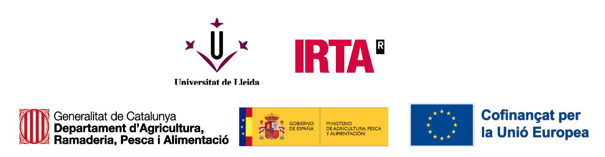

**FruitMeasureApp** has been developed by the [University of Lleida (UdL)](https://www.udl.cat/ca/) and the [Institute of Agrifood Research and Technology (IRTA)](https://www.irta.cat/) within the framework of the demonstrative project *FruitMeasureApp: Validació i prototipatge d’una aplicació mòbil basada en IA per mesurar fruits en camp* (Activity co-financed by the EU through intervention 7201 of the PAC Strategic Plan 2023-2027).

